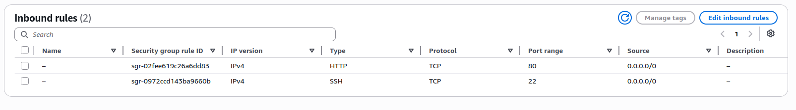
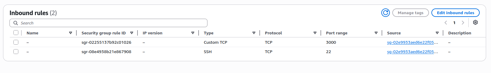
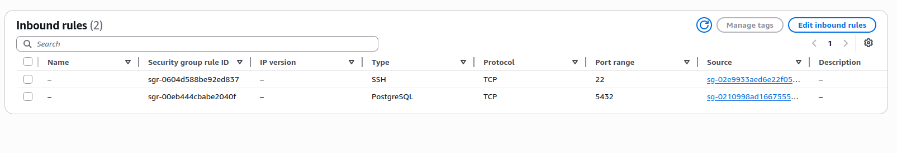

<h2>Architecture Setup</h2>
<p>
<h3>Goal:To up and run bmi-tracker app</h3>
*public server will contain front end and nginx,nginx use reverse proxy to private server2 
(backend),server 2 will get access of server 3 where db is present.</br>
*use .pem file to server1,in security group, 80 port will open for all,tcp,22 port ssh</br>
*in server2, custom tcp(3000) port open for only server1 security gruoup id. tcp(22 port) will open for server1 security gruoup id</br>
*in server3, db (port 5432) open only for server2 security gruoup id. tcp(22 port) will open for server1 security gruoup id
</p>
1. presentation security group(server 1)

2. application security group(server 2)

1. data security group(server 3)


<h2>Nginx Setup</h2>

```
server {
    listen 80;
    server_name 13.62.57.86(server1 ip);

    root /var/www/bmi-health-tracker;
    index index.html;

    # React SPA — serve index.html for all non-file routes
    location / {
        try_files $uri $uri/ /index.html;
    }

    # Proxy API requests to Node.js backend
    location /api/ {
        proxy_pass http://10.0.8.184:3000(server2 ip where backed appis running);
        proxy_http_version 1.1;
        proxy_set_header Upgrade $http_upgrade;
        proxy_set_header Connection 'upgrade';
        proxy_set_header Host $host;
        proxy_set_header X-Real-IP $remote_addr;
        proxy_set_header X-Forwarded-For $proxy_add_x_forwarded_for;
        proxy_set_header X-Forwarded-Proto $scheme;
        proxy_cache_bypass $http_upgrade;
    }

    # Security headers
    add_header X-Frame-Options "SAMEORIGIN";
    add_header X-Content-Type-Options "nosniff";
    add_header X-XSS-Protection "1; mode=block";
}
```

<h2>Backend Application</h2>
* installed pm2 for process management</br>
* upload backend of bmi_tracker in /var/www/backend </br>
*set up .env file like this 

```
PORT=3000
NODE_ENV=production
DB_TYPE=postgres
DB_HOST=10.0.144.119 (server 3 ip)          
DB_PORT=5432
DB_NAME=bmi_db             
DB_USER=saiful_admin        
DB_PASSWORD= 
```
*run this ( cd /var/www/backend
pm2 start src/server.js --name "bmi-backend") to startt pm2

<h2>Database</h2>
*Install PostgreSQL <br>
*sudo nano /etc/postgresql/16/main/postgresql.conf

    listen_addresses = 'localhost'
    Change it to:
    listen_addresses = '*', because app will not limited to only localhost


*sudo nano /etc/postgresql/16/main/pg_hba.conf
    
    # Allow Server2 cidr for postgresql access 
    host    all             all             10.0.0.0/16            md5

*create database user and password

```
sudo -u postgres psql, enter as postgresql super user

CREATE DATABASE bmi_db; create db

CREATE USER saiful_admin WITH ENCRYPTED PASSWORD 'your_secure_password'; create user and password

GRANT ALL PRIVILEGES ON DATABASE bmi_db TO saiful_admin; grant all privilages to that user of bmi_db

* Run the first migration 
psql -h localhost -d bmi_db -U saiful_admin -f ~/001_create_measurements.sql

* Run the second migration 
psql -h localhost -d bmi_db -U saiful_admin -f ~/002_add_measurement_date.sql

```
<h2>Debug</h2>

*Server 1 <br>
1.sudo nginx -t , check config is ok <br>
2.sudo tail -f /var/log/nginx/error.log, if any error then it show <br>
3.sudo tail -f /var/log/nginx/access.log
<br>

*Server 2 <br>
1.pm2 logs bmi-backend,  check any backend error <br>
2.nc -zv 10.0.144.119 5432, check db is accessible<br>
3.do curl to check database operation is ok :
curl -X POST http://localhost:3000/api/measurements \
  -H "Content-Type: application/json" \
  -d '{"weightKg": 80, "heightCm": 175, "age": 30, "sex": "female", "activity": "light"}' , check if any insertion operation ok or not

  